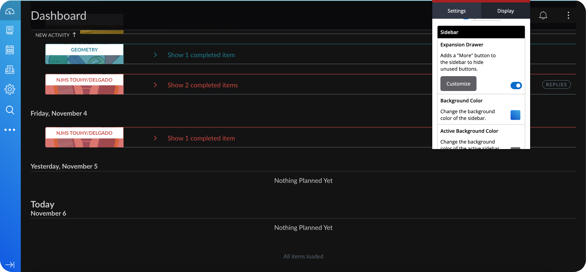

# Canvas Pro

 
 
The most powerful Chrome extension for Canvas 🔥

👉 Get it now [for Chrome](https://chrome.google.com/webstore/detail/canvas-pro/llaiiaclbjbncnalcbhbkfocadfgkfgc)

Power up your learning with color themes, navigation shortcuts, and improved performance.

Canvas Pro is a free Chrome Browser extension that improves the experience of students using Canvas. Everything you could need, from color themes, to navigation shortcuts, to improved performance.

Made by [Ishaan Garg](https://twitter.com/ishaantek)

[comment]: <> (Product Hunt)

## Table of contents
- [Canvas Pro](#CanvasPro)
  - [Table of contents](#table-of-contents)
  - [Features](#features)
  - [Self-hosting Canvas Pro](#self-hosting-CanvasPro)
  - [Installing on Canvas Pro](#installing-on-CanvasPro)
  - [Libraries used](#libraries-used)

## Features

⚙️ Easy-to-use settings menu and toggle-able features 
🎨 Highly customizable, with a full suite of appearance settings 
📬 Quick Inbox allows you to check previews of your emails without reloading the page 
🔎 Search all of your courses for pages and module items with a single click  ...and much more - all for free & no sign in needed!

## Self-hosting Canvas Pro
You can run Canvas Pro locally without having to install it from the Chrome Store.

### Installing on Chrome

1. Download the code. In the web version of GitHub, you can do that by clicking the green "Code" button, and then "Download ZIP".
2. Go to chrome://extensions/ in your browser, and [enable developer mode](https://developer.chrome.com/docs/extensions/mv2/faq/#:~:text=You%20can%20start%20by%20turning,a%20packaged%20extension%2C%20and%20more.).
3. Drag the [src folder](https://github.com/ishaantek/CanvasPro/tree/master/src) (make sure it's a folder and not a ZIP file, so unzip first), or click on the "Load unpacked" button and locate the folder.
4. That's it, you will now be able to use Canvas Pro locally.

## Libraries used
-   Styled with [Sass](https://sass-lang.com/guide)
-   Scripts with pure JS
-   Releases bundled with Gulp, [see dependencies](https://github.com/ishaantek/iPage/network/dependencies)

#
 Feel free to reach out to me through email at ishaan@ishaantek.com or [on Twitter](https://twitter.com/ishaantek) if you have any questions or feedback! Hope you find this useful 💙